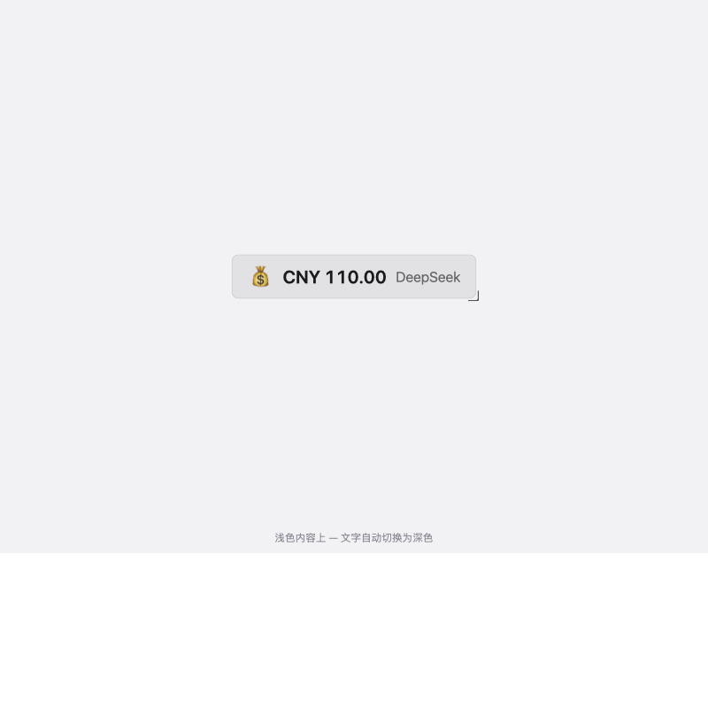
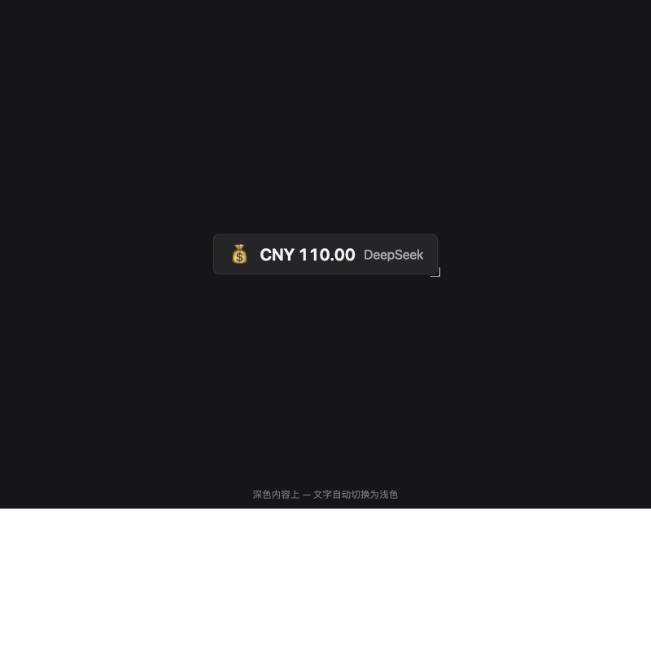
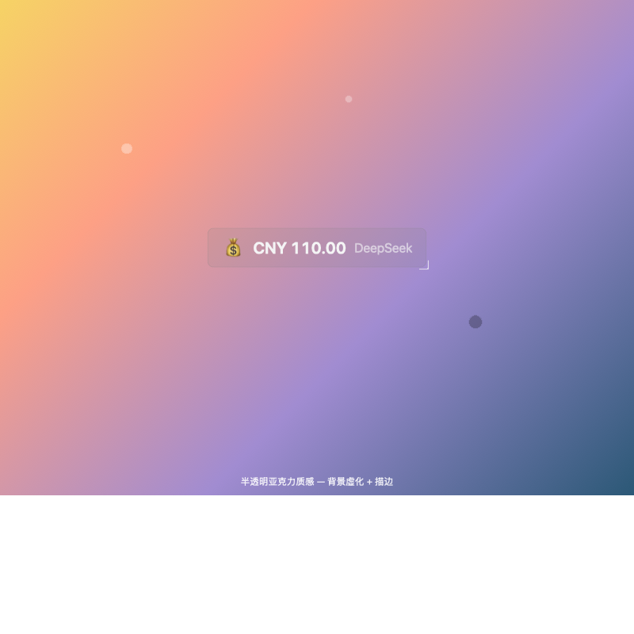

# DSH API Balance · Floating API Balance Badge

> A tiny floating badge for the [DeepSeek Harness](https://github.com/deepseek-ai) (DSH) Web GUI: live LLM-API account balance at a glance — draggable, resizable, frosted-glass texture, with text color that adapts to whatever content is underneath.

[](LICENSE)


[中文文档](README.zh-CN.md)

## 📸 Screenshots

<p align="center">
  
  
  
</p>

> The screenshots show the badge itself only — no real UI or conversation content.

## ✨ Features

- **Floats above everything**: frame-wide overlay, click-through, never blocks the app underneath
- **Drag anywhere**: grab the badge and drop it at any screen position
- **Free resizing**: pull the bottom-right handle, 70% – 250%
- **Acrylic texture**: translucent neutral tint + backdrop blur + fine border, blends naturally with light and dark skins
- **Adaptive text color**: samples the brightness of the content beneath in real time — light text on dark backgrounds, dark text on light backgrounds
- **Click to refresh + auto refresh**: one tap refreshes immediately; also refreshes every 10 minutes
- **Multi-provider**: DeepSeek, Moonshot (Kimi), OpenAI, or any custom endpoint
- **Key safety**: API keys live in the Harness credential store (`~/.dsh/.credentials.yaml`) and are never sent back to the browser; requests pass the key to `curl` via environment variable, never on the command line
- **Settings page**: configure provider & key, see balance details (total / granted / topped-up / available / used), toggle badge visibility, size slider, and position reset — under Settings › API Balance

## 📦 Installation

One command installs the plugin into your DSH `web` profile and registers it automatically (`dsh plugin` reconciles `dsh.profile.bundles` for you):

```bash
dsh plugin --profile web add github:GPIOX/dsh-api-balance
```

Then restart DSH (stop the `dsh` process and run it again, e.g. `dsh web`), refresh the page, and open **Settings › API Balance** to save your key — the badge shows up immediately.

Uninstall / rollback:

```bash
dsh plugin --profile web remove dsh-api-balance
```

> Also installable from the in-app **Market** (Settings › Plugins/Market) once listed in the [awesome-dsh-plugin](https://awesome-dsh-plugin.com) registry, or from a local checkout during development: `dsh plugin --profile web add link:/path/to/dsh-api-balance`.

### ⚡ Zero-install quick start (dynamic plugin)

Prefer not to touch your profile? Paste the plugin into any DSH Web GUI session as a dynamic plugin — no build, no restart:

1. Call the `cordis_define` tool (`kind: "new"`, any 3–6 letter prefix) and paste
   [`plugins/api-balance/host.js`](plugins/api-balance/host.js) / [`plugins/api-balance/client.js`](plugins/api-balance/client.js)
   as `code.host` / `code.client`
2. Activate the returned Package with `cordis_run` and click **Approve** on the run card
3. Open Settings › **API Balance**: pick a provider → paste your key → Save. The badge shows your balance immediately

> Dynamic plugins are process-local by design: after a DSH restart, re-define and re-activate (the source lives in this repo — just repeat the two steps).

## 🖥 Supported Providers

| Provider | Balance endpoint | Auth | Notes |
| --- | --- | --- | --- |
| DeepSeek | `GET https://api.deepseek.com/user/balance` | API Key (`sk-...`) | total / granted / topped-up (CNY) |
| Moonshot (Kimi) | `GET https://api.moonshot.cn/v1/users/me/balance` | API Key (`sk-...`) | available / voucher / cash (CNY) |
| OpenAI | `GET https://api.openai.com/dashboard/billing/credit_grants` | Browser session token (`sess-...`) | OpenAI offers no API-key balance endpoint; session tokens expire |
| Custom | any GET endpoint (Bearer auth) | your own | JSON field paths like `data.available_balance` or `balance_infos[0].total_balance` — fits relay stations etc. |

## 🔒 Security

- **Keys never leave the Host**: the browser only ever sees "configured / not configured"; the plaintext key is never returned to the page
- **Managed credential store**: keys are stored via the official Harness credential service (`~/.dsh/.credentials.yaml`), alongside other DSH secrets
- **Not on the command line**: `curl` receives `AI_BALANCE_KEY` through `env`, so it never shows up in process listings

## 📂 Repository Layout

```
.
├── assets/                  # README screenshots (badge renders, no real UI content)
├── lib/index.js             # Host half: /dsh-api-balance/* HTTP routes + credential handling
├── client/client.js         # Client half: floating badge + settings page (factory bundle)
├── cordis.patch.yml         # Bundle patch inserting this plugin into a profile
├── package.json             # DSH plugin package manifest (dsh.bundle / dsh.client)
├── plugins/api-balance/     # Same halves as dynamic-plugin sources (zero-install path)
│   ├── host.js
│   ├── client.js
│   └── README.md
├── LICENSE                  # MIT
├── README.md                # this file (English)
└── README.zh-CN.md          # 中文文档
```

## 📄 License

[MIT](LICENSE) © 2026 GPIOX
